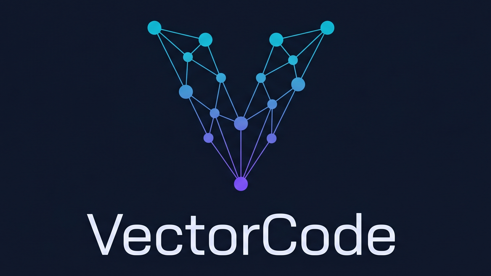

<div align="center">



<h1>VectorCode</h1>

<p><strong>Semantic code search MCP server using embeddings. Find code by meaning, not just by name.</strong></p>

<p>
<a href="https://github.com/alejandro-technology/vectorcode/actions/workflows/coverage.yml"></a>
<a href="https://github.com/alejandro-technology/vectorcode/actions/workflows/ci.yml"></a>
<a href="LICENSE"></a>


</p>

</div>

## What is VectorCode?

VectorCode fills the gap between exact string matching (`grep`) and structural analysis (CodeGraph). It enables **semantic search** over your codebase — finding code by concept when you don't know the exact symbol name, pattern, or terminology.

**Example queries that VectorCode answers:**

- "code that handles payment retries"
- "where do we validate user permissions"
- "functions similar to createUser"
- "error recovery logic"

## How It Works

1. **Chunk** — Source files are parsed with tree-sitter into semantically meaningful chunks (functions, classes, methods)
2. **Embed** — Each chunk is converted to a vector embedding using your chosen provider (ONNX, Gemini, Ollama, OpenAI)
3. **Store** — Vectors are stored in SQLite with `sqlite-vec` for fast similarity search
4. **Search** — Natural language queries are embedded and compared via cosine similarity
5. **Watch** — A file watcher auto-syncs the index when files change (debounced, gitignore-aware)

## Installation

### From Source (requires Rust 1.75+)

```bash
cargo install --path .
```

### Using install.sh (macOS/Linux)

```bash
curl -fsSL https://raw.githubusercontent.com/alejandro-technology/vectorcode/main/install.sh | bash
```

### Configure Your Agent

```bash
vectorcode install
```

This auto-detects your AI coding agents and adds VectorCode to their MCP configuration.

Supported agents:

- **OpenCode** — `opencode.json` → `mcpServers`
- **Claude Code** — `~/.claude/claude_desktop_config.json`
- **Cursor** — `.cursor/mcp.json`
- **Gemini CLI** — `~/.gemini/settings.json`
- **Antigravity** — `~/.gemini/antigravity/settings.json`

## Usage

### Initialize a Project

```bash
cd your-project
vectorcode init
```

Options:

- `--provider <onnx|gemini|ollama|openai>` — Embedding provider (default: onnx)
- `--model <name>` — Model name for the provider
- `--dims <n>` — Embedding dimensions
- `--index` — Also run initial indexing

### Index Your Codebase

```bash
# Full index
vectorcode index

# Index specific file
vectorcode index --file src/auth.ts

# Full reindex (drop and rebuild)
vectorcode index --full

# Custom concurrency
vectorcode index --concurrency 16
```

### Search

```bash
# Basic search
vectorcode search "payment retry logic"

# With filters
vectorcode search "auth middleware" --language typescript --path src/

# Search modes
vectorcode search --mode dense "query"      # Dense vector search (default)
vectorcode search --mode sparse "query"     # BM25 lexical search (FTS5)
vectorcode search --mode hybrid "query"     # Dense + Sparse RRF fusion
vectorcode search --mode hybrid-rerank "query"  # Hybrid + ONNX cross-encoder reranking

# JSON output
vectorcode search "error handling" --json

# Custom limit and threshold
vectorcode search "database connection" --limit 20 --threshold 0.5
```

### Reranker (Hybrid+Rerank Mode)

VectorCode supports an optional ONNX cross-encoder reranker that re-scores the
top-K hybrid search results for higher precision. The reranker runs locally
(no API calls) using the [BGE-Reranker-v2-m3](https://huggingface.co/Xenova/bge-reranker-v2-m3) model (~571MB).

```bash
# Enable reranker in config (.vectorcode/config.toml):
[search.rerank]
enabled = true
top_k = 20          # Re-rank top 20 hybrid results
timeout_ms = 5000   # Fallback to hybrid if reranker exceeds timeout
```

If the reranker fails to load or times out, search gracefully falls back to
plain hybrid mode — no errors, no interrupted queries.

### MCP Server

```bash
# Start the MCP server (used by AI agents)
vectorcode serve --mcp

# Disable file watcher
vectorcode serve --mcp --no-watch

# Custom debounce interval
vectorcode serve --mcp --debounce 5000
```

### Status

```bash
vectorcode status
```

### Install/Uninstall

```bash
# Auto-configure all detected agents
vectorcode install

# Configure specific agent
vectorcode install --target opencode

# Remove from all agents
vectorcode uninstall

# Remove from specific agent
vectorcode uninstall --target cursor
```

## Configuration

Configuration is stored in `.vectorcode/config.toml`:

```toml
[provider]
name = "onnx"  # onnx | gemini | ollama | openai

[provider.gemini]
api_key = "your-api-key"
model = "gemini-embedding-2"
dimensions = 768

[provider.ollama]
url = "http://localhost:11434"
model = "embeddinggemma:latest"

[provider.openai]
api_key = "your-api-key"
model = "text-embedding-3-small"

[indexing]
max_file_size = 1048576   # 1MB
concurrency = 8
exclude_dirs = [".vectorcode", ".git", "node_modules", "target"]
exclude_extensions = [".min.js", ".map", ".lock"]

[watcher]
debounce_ms = 2000
disabled = false

[search]
default_limit = 10
default_threshold = 0.3
mode = "dense"            # dense | sparse | hybrid | hybrid-rerank

[search.rrf]
k = 60                    # RRF fusion constant

[search.rerank]
enabled = false
top_k = 20                # Re-rank top-K hybrid results
timeout_ms = 5000         # Fallback to hybrid on timeout
```

### Environment Variable Overrides

| Variable                 | Description                   |
| ------------------------ | ----------------------------- |
| `VECTORCODE_PROVIDER`    | Override provider name        |
| `GEMINI_API_KEY`         | Gemini API key                |
| `OPENAI_API_KEY`         | OpenAI API key                |
| `VECTORCODE_NO_WATCH`    | Set to `1` to disable watcher |
| `VECTORCODE_DEBOUNCE_MS` | Override debounce interval    |

## Supported Languages

| Language   | Extensions                    | Tree-sitter Grammar    |
| ---------- | ----------------------------- | ---------------------- |
| TypeScript | `.ts`                         | tree-sitter-typescript |
| TSX        | `.tsx`                        | tree-sitter-typescript |
| JavaScript | `.js`, `.jsx`, `.mjs`, `.cjs` | tree-sitter-javascript |
| Python     | `.py`                         | tree-sitter-python     |
| Rust       | `.rs`                         | tree-sitter-rust       |
| Go         | `.go`                         | tree-sitter-go         |
| Java       | `.java`                       | tree-sitter-java       |

## MCP Tools

When running as an MCP server, VectorCode exposes the following tools:

### `vec_search`

Semantic code search — find code by meaning, not just by name.

Parameters:

- `query` (required) — Natural language description of what you're looking for
- `limit` (optional, default: 10) — Maximum results (max: 100)
- `threshold` (optional, default: 0.3) — Minimum similarity score (0.0–1.0)
- `language` (optional) — Filter by language
- `path` (optional) — Filter by file path prefix

### `vec_status`

Check the status of the VectorCode index, including provider, dimensions, number of files indexed, and last sync time.

### `vec_reindex`

Trigger a background re-index of the project.

Parameters:

- `full` (required) — Set to true to drop the index and start fresh

### `vec_read_lines`

Read a specific range of lines from a file. Use this instead of generic file reading when you only need to expand the context around a snippet found via vec_search.

Parameters:

- `file_path` (required) — The file path to read
- `start_line` (required) — The starting line number (1-indexed, inclusive)
- `end_line` (required) — The ending line number (1-indexed, inclusive)

Notes:
- Max 500 lines per call
- Max file size: 2MB
- Path must be within project bounds

### `vec_outline`

Get a structural outline of a source file — top-level functions, classes, structs, interfaces, and traits with their signatures. Useful for understanding file structure without reading the entire file.

Parameters:

- `file_path` (required) — The file path to outline (relative to project root)

Notes:
- Max file size: 2MB
- Path must be within project bounds

## Benchmarks

This section tracks the ongoing validation and ROI metrics of VectorCode across different SDD flow phases.

| Fase | Descripción | Métrica Principal | Resultado |
| ---- | ----------- | ----------------- | --------- |
| 1 | Precisión IR y Rendimiento | P@1, P@3, P@5, Latencia | ✅ Completado |
| 2 | Ahorro de Tokens (Agente E2E) | Reducción de Input Tokens vs Baseline | ✅ Completado (Real LLM) |
| 3 | Saturación de Contexto (Context Bloat) | Puntuación del AI Judge | ✅ Completado (Real LLM) |

### Fase 1: Precisión IR

**Dataset:** 50 pares query→ruta esperada, 13 áreas del codebase, 84% queries en lenguaje natural vago.

| Métrica | ONNX | Ollama (nomic) | Ollama (gemma) | Target |
| ------- | ---- | -------------- | -------------- | ------ |
| Cold Index (median) | 3.62s | 16.50s | 23.24s | — |
| Cold Index (P95) | 3.68s | 26.40s | 24.30s | — |
| Search Latency (median) | 87.50 ms | **37.49 ms** ✅ | 117.57 ms | <100 ms |
| Search Latency (P95) | 92.80 ms | **42.08 ms** | 136.71 ms | — |
| **Precision@1** | 48.00% | 68.00% | **74.00%** | — |
| **Precision@3** | 70.00% | 84.00% | **86.00%** | — |
| **Precision@5** | 74.00% | 86.00% | **92.00%** | — |
| Peak RSS | 17.2 MB | 16.1 MB | 16.7 MB | — |

| Provider | Modelo | Dims | Perfil |
| -------- | ------ | ---- | ------ |
| **ONNX** | MiniLM-L6-v2 (~80MB) | 384 | ⚡ Indexado más rápido (3.6s), precisión básica |
| **Ollama + nomic** | nomic-embed-text (~274MB) | 768 | 🚀 Mejor latencia (37ms), buena precisión — balance óptimo |
| **Ollama + gemma** | embeddinggemma:latest (621MB) | 768 | 🎯 Máxima precisión (P@5=92%), indexado más lento |

> 3 iteraciones × 50 queries cada una. Resultados: mediana a través de iteraciones.
> `VECTORCODE_MODEL=nomic-embed-text` para cambiar modelo en benchmarks. Reporte en `benchmarks/results/phase1_report.json`.

### Fase 2: Ahorro de Tokens (Agente E2E)

**Objetivo:** Validar que un agente real (`kimi-k2.6`) consuma menos tokens y cometa menos errores usando VectorCode vs herramientas clásicas (`grep`/`find`).

**Metodología:** Simulador de agente ReAct en Python usando la API de OpenCode Go. El agente busca convenciones en `install.rs` para crear `status.rs`.

| Modelo | Brazo A (Bash/Grep) | Brazo B (VectorCode) | Mejora |
| ------ | ------------------- | -------------------- | ------ |
| **mimo-v2.5-pro (high effort)** | 252,531 tokens | 98,197 tokens | **-61.1%** |
| **qwen3.7-plus** | 106,896 tokens | 43,434 tokens | **-59.4%** |
| **kimi-k2.6** | 222,893 tokens | 154,248 tokens | **-30.8%** |
| **minimax-m3** | 12,552 tokens | 19,688 tokens | +56.9%* |

> * **Análisis Crítico (Fase 2):** Con la introducción del nuevo parser/outliner AST (`vec_outline`), resolvimos exitosamente la "ansiedad exploratoria" que afectaba a modelos de razonamiento profundo como **mimo-v2.5-pro**, logrando un ahorro masivo de **-61.1% de tokens** (comparado con el +24.2% de exceso de la versión anterior). **qwen3.7-plus** también demostró una excelente sinergia con la nueva tool, reduciendo el consumo en un **-59.4%**. Minimax-m3 fue la única excepción, ya que en este intento realizó búsquedas de outline redundantes para validar su propuesta de código. Esto confirma que `vec_outline` es la pieza que faltaba para un UX eficiente de agentes en archivos individuales.

### Fase 3: Saturación de Contexto (Context Bloat)

**Objetivo:** Demostrar que VectorCode evita el "Context Bloat" y la saturación de memoria ("Lost in the Middle") en preguntas arquitectónicas globales.

**Metodología:** Agente ReAct responde cómo funciona el sistema de embeddings. El Brazo A usa `bash` y `read_file`. El Brazo B usa *exclusivamente* `vec_search` sin poder leer archivos enteros.

| Modelo | Brazo A (Bash/Grep) | Brazo B (VectorCode) | Mejora |
| ------ | ------------------- | -------------------- | ------ |
| **minimax-m3** | 24,550 tokens | 36,211 tokens | +47.5% |
| **mimo-v2.5-pro (high effort)** | 82,755 tokens | 154,865 tokens | +87.1% |
| **qwen3.7-plus** | 46,105 tokens | 149,581 tokens | +224.4% |
| **kimi-k2.6** | 42,836 tokens | 388,652 tokens | +807.3% |

> * **Análisis Crítico (Fase 3):** En esta iteración de la Fase 3, observamos un incremento en los tokens acumulados para el Brazo B. Esto se debe a una decisión de diseño de la versión V2: el límite de truncamiento para los resultados de `vec_search` se elevó a **15,000 caracteres** (aproximadamente 3,750 tokens por llamada) para entregar fragmentos de código más completos y evitar respuestas imprecisas. Al realizar múltiples consultas semánticas de forma secuencial, el historial acumulativo de ReAct duplicó el contexto en cada paso de la conversación. Esto subraya el trade-off clásico en RAG: fragmentos más amplios aseguran la comprensión del modelo, pero incrementan exponencialmente el costo de tokens en loops ReAct de múltiples turnos.

## Architecture

```
┌─────────────────────────────────────────────────────────────┐
│                     vectorcode (Rust binary)                │
│                                                             │
│  ┌──────────┐   ┌──────────────┐   ┌─────────────────────┐ │
│  │ CLI      │   │ MCP Server   │   │ File Watcher        │ │
│  │ (clap)   │   │ (stdio JSON- │   │ (notify crate,      │ │
│  │          │   │  RPC)        │   │  debounced)          │ │
│  └────┬─────┘   └──────┬───────┘   └──────────┬──────────┘ │
│       │                │                       │            │
│       └────────┬───────┴───────────────────────┘            │
│                │                                            │
│       ┌────────▼────────┐                                   │
│       │   Core Engine   │                                   │
│       │  ┌───────────┐  │  Tree-sitter AST parsing          │
│       │  │ Chunker   │  │                                   │
│       │  └─────┬─────┘  │                                   │
│       │        │        │                                   │
│       │  ┌─────▼─────┐  │  Provider trait (ONNX/Gemini/     │
│       │  │ Embedder  │  │  Ollama/OpenAI)                   │
│       │  │ (trait)   │  │                                   │
│       │  └─────┬─────┘  │                                   │
│       │        │        │                                   │
│       │  ┌─────▼─────┐  │  SQLite + sqlite-vec              │
│       │  │ Store     │  │  (.vectorcode/index.db)           │
│       │  └───────────┘  │                                   │
│       └────────────────┘                                   │
└─────────────────────────────────────────────────────────────┘
```

## License

MIT